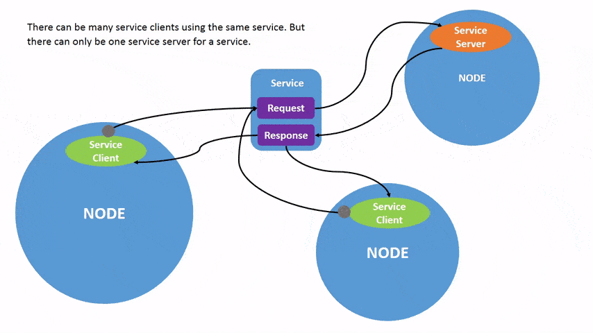

# Chapter 00 – Introduction

> **Goal:** By the end of this chapter you should be familiar with the ROS2 fundemental concepts and their core commands.

---

## Objectives
By the end of this chapter you will be able to:
- Understand Nodes and its basics
- Understand Topics and its basics
- Understand Services and its basics
- Understand Parameters
- Understand Actions and its basics

---

## Prerequisites
- ROS 2 Humble installed ([Offical Documentation](https://docs.ros.org/en/humble/Installation.html))  

---

## 1. Why this matters
All of the above topics mentioned in objectives make up what is ROS2. These topics are fundemental to using ROS2 in a powerful way and having a greater understanding of these will prove to be a useful tool in robotic applications. They are the building blocks of robotic software.

---

## 2. Nodes

1. **Command to run specfic program from a ROS 2 pacage**  
   ```bash
   # ros2 run <package_name> <executable_name>
   ```
   The ___ros2 run <package_name> <executable_name>___ command launches a pre-built node (executable) from a specified __ROS 2__ package. It's used to start a specifc part of your robot's software, like a sensor or controller, that's aldready been complied. __Pitfall__: If the pacage isin't built or sourced properly (i.e., you didn't run source _install/setup.bash_), it wont find the package or executable.

2. **Command to launch the Turtlesim program and its main node** 
   ```bash
   # ros2 run turtlesim turtlesim_node
   ```
   The command ___ros2 run turtlesim turtlesim_node___ starts the turtlesim program by running the turtlesim_node from the turtlesim package.

3. **Command to check multiple node lists**  
   ```bash
   # ros2 node list /turtlesim
   ```
   The ros2 node list command shows all active ROS 2 nodes currently running, which helps you keep track of your robot's part. __Pitfalls__: If no nodes are listed, it likley means no nodes are running (or the terminal hasn't sourced he __ROS 2__ setup file.) Also running this is in a terminal that doesn't properly source __ROS 2__, won't display anything.


   ```bash
   # ros2 run turtlesim turtle_teleop_key
   ```

   When you run __ros2 run turtlesum turtlesim_node__, it starts the ___/turtlesim_ node__, and running ros2 run __turtlesim turtle_teleop_key__ starts another node called __/teleop_turtle__. By running ___ros2 node list___ again, you'll see both nodes listed, confirming that they're up and running. __Notes__: Use the arrow keys to move turtle in real time! Great for testing node inetraction and topic publishing (it sends velocity commands to __/turtle1/cmd_vel__).
   
   ```bash
   # ros2 node list /turtlesim /teleop_turtle
   ```
   This command runs the __turtle_teleop_key__ executable from the turtlesim package, which lets you control the turtle with your keyboard. When you check ros2 node list again, you’ll see both the __/turtlesim__ and __/teleop_turtle__ nodes running.
   

4. **Remapping**  
   ```bash
   # ros2 run turtlesim turtlesim_node --ros-args --remap __node:=my_turtle
   ```
   The command __ros2 run turtlesim turtlesim_node --ros-args --remap__ __node:=my_turtle__ runs the turtlesim node but changes its default name from __/turtlesim__ to __/my_turtle__. This lets you run multiple turtlesim nodes without name conflicts or customize the node name for easier identification. You can verify the change by running ros2 node list, which will now show __/my_turtle__ instead of __/turtlesim__.

5. **Examination of nodes**  
   ```bash
   # ros2 node info /my_turtle
   ```
   This command displays all the communication interfaces associated with the __/my_turtle node__. It shows which topics the node subscribes to (e.g., __/turtle1/cmd_vel__), publishes to (like __/turtle1/pose__), and the services and actions it provides or uses (like __/spawn__, __/reset__, __/turtle1/rotate__ absolute). This helps visualize how __/my_turtle__ interacts with the rest of the ROS system.

---
## 3. Topics

1. **RQT Graph**  
   ```bash
   # rqt_graph
   ```
   This command opens a graphical tool that visually shows the nodes and the topics they're connected through. For example, in the turtlesim setup, it will show how /teleop_turtle publishes to the __/turtle1/cmd_vel__ topic, and how __/turtlesim__ subscribes to it to move the turtle.  When systems get more complex, rqt_graph helps you quickly trace who’s talking to whom, what topics are in use, and spot if a node is lonely and disconnected. You can open rqt_graph by opening rqt and selecting __Plugins > Introspection > Node Graph__. You should see the above nodes and topic, as well as two actions around the periphery of the graph (let’s ignore those for now). If you hover your mouse over the topic in the center, you’ll see the color highlighting like in the image above.

2. **Topics**  
   ```bash
   # ros2 topic list
   ```
   The __ros2 topic list__ command shows all the active topics in your ROS 2 system — basically, all the channels your nodes are using to send or receive information. Using ros2 topic list -t also shows the message type for each topic, which is important because both the publisher and subscriber must use the same type to communicate. This helps you understand what kind of data is flowing where, like position updates or velocity commands. __Pitfall__: If no topics show up, it usally means no nodes are cuurently publishing or subscribing-double check if the nodes are running. 
   __Pitfall__: Just because a topic exists doesn't mean it's active-it may not be publishing any data yet. 


3. **ros2 topic echo**  
   ```bash
   # ros2 topic echo <topic_name>
   ```
   The ros2 topic echo <topic_name> command lets you see the live data being published on a specific topic, like peeking into the conversation between nodes. For example, ros2 topic echo __/turtle1/cmd_vel__ shows velocity messages sent by the teleop node when you move the turtle with arrow keys. It's super helpful for debugging and understanding what data your robot is actually receiving or sending.__Pitfall__: At first, you might not see any outputs-that just means no data is being published yet, so the command is waiting. __Notes__: Use Ctrl+C to stop the echo command when you're done watching the data. The echo command creates a temporary node which will appear in tools like rqt_graph as a subscriber. 


   ```bash
   # ros2 topic echo /turtle1/cmd_vel
   ```
   The command __ros2 topic echo /turtle1 cmd_vel__ listens to the __/turtle1/cmd_vel__ topic and displays the velocity data being published to control the turtle. At first, nothing appears because it’s waiting for the /__teleop_turtle__ node to send data — which only happens when you press the arrow keys in the terminal running __turtle_teleop_key__. Once you start moving the turtle, the echo terminal will show live linear and angular velocity messages being published.

5. **Actions**  
   ```bash
   # next command or snippet
   ```
   _Notes/pitfalls to watch for._

---


## 3. Services
Services are a call-and-response form of communication between two nodes(reference nodes if needed). It does not use a publisher-subscriber model which relies on asynchronous communication where one sends it and the other receives it. __Services replace topics and instead of updating information continuously, allows for the client to choose when and what information to receive. It gives the client essentially the same control as the server.__ 

_Note that there can be many clients, but only one service server._



1. **Accessing the Services List**  
   ```bash
   ros2 service list
   ```
   _This will open the full list of commands that are present using rqt(reference rqt here if needed) and the services for the two different nodes. When you first open them, notice how they both have services with the name `parameter` in them._

3. **Understand Services Types**  
   _Service types describe how the call and response is structured. In this way, they are similar to topic types. We can differentiate them though because service types have two messages instead of just one. There is a message for the request and one for the response._

4. **Finding Service Type**  
   ```bash
   ros2 service type <service_name>
   ```
   _This will return the type in your terminal. To see the types of all the active services, use ` ros2 service list -t`. The `-t` is what helps to display all the types for the services in the list. We use the type when needing to know which services have nodes that information can be moved through_

5. **Finding Service Info**  
   ```bash
   ros2 service info <service_name>
   ```
   _This will return how many services and clients there are active. This is helpful when needing to make a request to a server and waiting for a response._

6. **Finding a Service**
   ```bash
   ros2 service find <type_name>
   ```
   _Where type name can be those such as `std_srvs/Empty`, `std_srvs/SetBool`, `std_srvs/Trigger`, and others that are not predefined by ROS2. This is used to find all the services of that specific type._

7. **Interface Showing**
   ```bash
   ros2 interface show <type_name>
   ```
   _This will show all the expected argument or information that should be passed through an internface. This section will be show on the top half of the response, seperated with a `---`. The bottom half is the structure of the response._

8. **Directly Call A Service**
   ```bash
   ros2 service call <service_name> <service_type> <arguments>
   ```
   _This is used to manually call a service from the terminal. It is used to debug, test, and interact with the running services without writing code._

---

## 4. Parameters
Parameters are exactly that. They're a parameter (or an argument for broader coding terms) that you can pass through with a node (or anything else). These are changable at run time and don't require any editting of the code.

1. **To display passable parameters for active nodes**  
   ```bash
   $ ros2 param list
   /teleop_turtle:
      qos_overrides./parameter_events.publisher.depth
      qos_overrides./parameter_events.publisher.durability
      qos_overrides./parameter_events.publisher.history
      qos_overrides./parameter_events.publisher.reliability
      scale_angular
      scale_linear
      use_sim_time
   /turtlesim:          # This is the Node name
      background_b      # This is the Parameter name for that node
      background_g
      background_r
      qos_overrides./parameter_events.publisher.depth
      qos_overrides./parameter_events.publisher.durability
      qos_overrides./parameter_events.publisher.history
      qos_overrides./parameter_events.publisher.reliability
      use_sim_time
   ```
   _`<node name>` can optionally be added to the end of the command, but passing it will show all parameters that are specific to that node._

2. **To view all the values of a node's parameters**  
   ```bash
   ros2 param dump <node_name>
   ```
   _It is possible to "archive" or save the current settings of that node’s parameters by adding a `> <file_name>.yaml` after the node name. It will automatically make a file if needed._

3. **To load the presets from a `.yaml` file**  
   ```bash
   ros2 param load <node_name> <file_name>
   ```

4. **To find the type and the current value of a parameter**  
   ```bash
   ros2 param get <node_name> <parameter_name>
   ```

5. **To change the value of a parameter**  
   ```bash
   ros2 param set <node_name> <parameter_name> <value>
   ```
It should be noted that any changes to parameters are __not__ permanent. If you plan to use a set of parameter over multiple sessions it's important to save and load them with a `.yaml` file (commands 2 and 3).

---

## 5. Actions
Actions combine a lot of the topics that were discussed earlier on, but fundementally they are broken down into three parts: __Goal Service, Feedback Topic and Result Service__. 

1. **To view all actions within the ROS system**  
   ```bash
   ros2 action list
   ```
   _Tack on a `-t` to list the action types as well. You can also search for the type of one singular action with `ros2 action type <action_name>`._

2. **To view more infomation about an action**  
   ```bash
   ros2 action info <action_name>
   ```
   _This will return the action name, the node(s) that have an action client for the action, and the node(s) that have an action server for the action._

3. **To "interface show" an action**  
   ```bash
   ros2 interface show <action_type>
   ```
   _Three sections will appear, being separated by `---`:_

    _- Structure for the goal request_

    _- Structure for the result response_

    _- Structure for the feedback_

    _This is needed for the next command which is how you send an action. Knowing the format is key to passing a successful action._

4. **To send a goal (which is sending a direct action request)**  
   ```bash
   ros2 action send_goal <action_name> <action_type> <values>
   ```
   _`values` needs to be in __yaml__ format in order for the action to be carried out. You can also get the live feedback by tacking on `--feedback` to the very end of the command._

---

## 4. Try it

__Let's do an exercise that focuses mainly on actions since they're a bit complex. For this, we can simply invoke an action that will make the turtle spin.__

Open two teminals and run the two fundemental nodes of turtlesim.

```bash
ros2 run turtlesim turtlesim_node
ros2 run turtlesim turtle_teleop_key
```
Making a turtle spin or rotate is an action, so let's find which action we need to invoke to pass that action directly.

```bash
ros2 action list
```
Only one should appear which is exactly what we need. You can look at more information for the action that appears, but for the sake of this small exercise we'll skip to find out what needs to be passed for an action to be carried out.
```bash
ros2 interface show turtlesim/action/RotateAbsolute
```
Since we want to directly pass an action, we only need to pay attention to the first part of the output. If you remember, that's the structure for the goal request. This means that we'll need to pass in a theta value in radians.

Now that we know what's needed to call an action, lets send a direct request.

```bash
ros2 action send_goal /turtle1/rotate_absolute turtlesim/action/RotateAbsolute "{theta: 1.46}"
```
The 1.46 can be changed as you so please, but if you look at the window with the turtle on it you should see it spinning. It is semi important to note that 1.46 is what degree the turtle will spin to, not how much it will spin.

That's all there is! This was a farely easy and basic intro to actions with ROS2 and turtlesim.

---

## 5. Common errors & fixes (if any)

| Symptom                         | Likely cause                   | Quick fix                          |
|---------------------------------|--------------------------------|------------------------------------|
| `command not found`             | You forgot to `source` the setup script. | `source install/setup.bash`        |
| Node crashes on startup         | Bad parameter file or YAML indentation.   | Check syntax/indentation in your params file. |
| Node/Topic not found            | You typed the wrong one, or it doesn't exist. | Use `ros2 node/topic list` to check. |


---

## Further reading and references
- Official ROS 2 docs: [Beginner: CLI Tools](https://docs.ros.org/en/humble/…)
- Personal notes on ROS 2 basics: [Crash Course to ROS2](https://www.notion.so/209bde9c918a804ea088eea56d9bc847?pvs=25)
